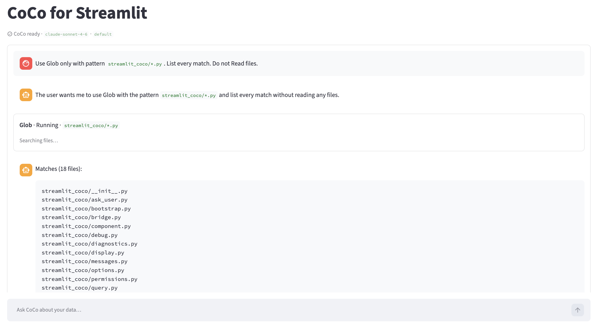

# streamlit-coco

**Bring Snowflake CoCo into Streamlit** — streaming agent UI, tool cards you can actually read, and approval gates that fit governed data apps.

[](https://github.com/lletourmy/streamlit-coco/actions/workflows/ci.yml)
[](https://opensource.org/licenses/Apache-2.0)

You own the page. CoCo owns the session. `panel()` streams the transcript; your app keeps `st.chat_input`, metrics, and forms. Approvals pause Write / Edit / Bash / SQL until someone clicks **Approve once**, **Always allow**, or **Deny**.



> Alpha `0.1.0` — API may still move. Star / watch the repo if you plan to ship on it.

**Repo:** [github.com/lletourmy/streamlit-coco](https://github.com/lletourmy/streamlit-coco) *(temporary PyPI source)* · **Dev:** [streamlit-coco-dev](https://github.com/DevoteamSP/streamlit-coco-dev)  
**SDK docs:** [Cortex Code Agent SDK](https://docs.snowflake.com/en/user-guide/cortex-code-agent-sdk/cortex-code-agent-sdk)

---

## Why this package

| Without streamlit-coco | With streamlit-coco |
| --- | --- |
| Wire CoCo yourself across Streamlit reruns | Session + fragment polling that keeps streaming |
| Raw JSON tool dumps | Meaningful cards (Glob, Grep, Read, Write, SQL, AskUser…) |
| Hope the agent behaves | `require_approval_for` + HITL UI |
| Chat-only demos | Structured callbacks into your own widgets |

Also: headless `query()` for scripts and CI, plus a legacy all-in-one `chat()` if you want built-in input.

---

## Install

```bash
uv add "streamlit-coco[sdk]"
# or: pip install "streamlit-coco[sdk]"
```

From a clone (editable + tests):

```bash
make install
```

### Prerequisites

1. Python **3.10+** · Streamlit **≥ 1.53**
2. CoCo CLI on `PATH` (`cortex --version`)
3. Authenticated Snowflake connection (`~/.snowflake/connections.toml` or equivalent)
4. `cortex-code-agent-sdk` (pulled in by the `sdk` / `dev` extras)

**Full local setup:** [`doc/deployment/local.md`](doc/deployment/local.md) (CLI install, Snowflake `connections.toml`, running examples, troubleshooting).  
**API:** [`doc/api.md`](doc/api.md).

---

## Quickstart

Preferred pattern — **you own the input**; CoCo owns the session and output:

```python
import streamlit as st
import streamlit_coco as st_coco

opts = st_coco.CocoOptions(
    connection="analytics",
    cwd=".",
    allowed_tools=["Read", "Glob", "Grep"],
    require_approval_for=["Edit", "Write", "Bash"],
)

env = st_coco.check_environment(connection=opts.connection)
if not st_coco.render_start_gate(opts, session_key="copilot", env=env):
    st.stop()

session = st_coco.get_or_create_session(opts, key="copilot")
st_coco.panel(session=session, warm_up=True, show_status=True, run_every=0.25)
st_coco.chat_input_bar(session, placeholder="Ask CoCo…")
```

- `allowed_tools` — may auto-run (enforced in Python when approvals are configured)
- `require_approval_for` — pause for Approve once · Always allow · Deny

Legacy all-in-one component (built-in input):

```python
st_coco.chat(session=session, key="coco_chat", height=560)
```

---

## Try the demos

```bash
make chat          # panel + chat input + tool cards + approvals
make approval      # legacy CCv2 chat
make structured    # custom structured-output panel
make headless      # asyncio query() pipeline
make backlog       # Product Backlog Desk (multipage business demo)
```

Exploratory prompts: [`examples/testdata/prompts.json`](examples/testdata/prompts.json).  
Backlog desk: [`examples/backlog_desk/README.md`](examples/backlog_desk/README.md).

---

## Patterns you’ll use often

### Structured output → your widgets

```python
output = st.container()

def render(data: dict, result: st_coco.CocoChatResult) -> None:
    with output:
        st.dataframe(data.get("selected_features", []))

st_coco.panel(session=session, on_structured_output=render)
```

### Headless (no Streamlit UI)

```python
import asyncio
import streamlit_coco as coco

async def run():
    async for event in coco.query("Profile ANALYTICS.CUSTOMERS"):
        if event.type == "result":
            print(event.structured_output)

asyncio.run(run())
```

---

## What’s inside

| Capability | Entry points |
| --- | --- |
| Native panel + approvals | `panel()`, `chat_input_bar()`, `render_approvals()` |
| Tool cards & AskUser / plan UI | see [`doc/features/tools-display/`](doc/features/tools-display/) |
| Session & options | `CocoSession`, `CocoOptions`, `get_or_create_session` |
| Headless events | `query()` |
| Legacy CCv2 | `chat()` |

API reference: [`doc/api.md`](doc/api.md).  
Feature guides + release checklists: [`doc/features/README.md`](doc/features/README.md).

```
streamlit_coco/   # library (ui, session, permissions, tool cards, …)
examples/         # chat, approval, structured, headless demos
doc/             # PRD, roadmap, feature specs & checklists
tests/
```

---

## Development

```bash
make install   # uv sync --extra dev
make check     # ruff + pytest
make audit     # pip-audit
make format    # ruff format + fix
make build     # sdist + wheel
make sync-release  # copy tree → ../streamlit-coco (see doc/deployment/publish.md)
make help      # all targets
```

CI runs lint, tests, and pip-audit on every PR to `main`.  
**Releases:** develop here (`streamlit-coco-dev`), sync + tag on [`lletourmy/streamlit-coco`](https://github.com/lletourmy/streamlit-coco) → PyPI ([guide](doc/deployment/publish.md)).

**Docs:** [PRD](doc/prd.md) · [API](doc/api.md) · [Roadmap](doc/roadmap.md) · [Deployment](doc/deployment/) · [Changelog](CHANGELOG.md) · [AGENTS.md](AGENTS.md)

---

## License

Apache-2.0
