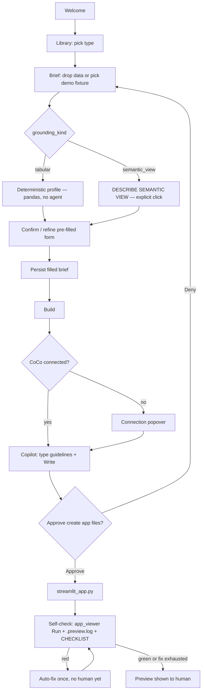
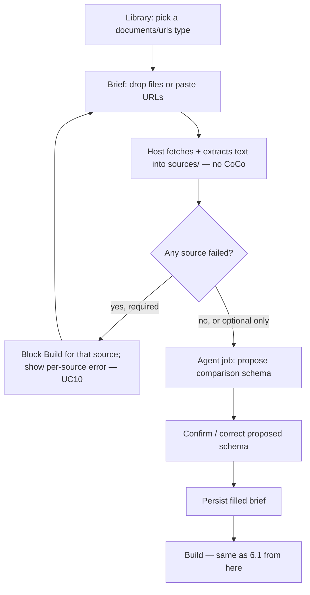
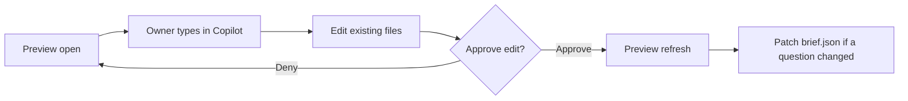
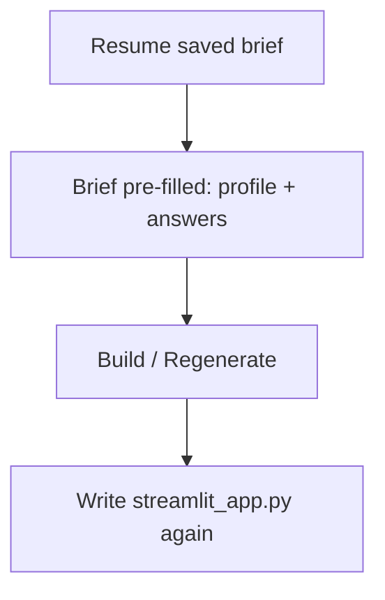

# App Builder — users, use cases, UX flows

**Feature:** [`app-builder.md`](app-builder.md)
**Cut:** `0.1.8`
**Status:** Shipped in `0.1.8` — example in `examples/app_builder` (`make app-builder`)
**Last updated:** 2026-09-06

This is the product brief for the **example app**, not for library integrators.
PRD §4.1 “App builder” is the person who *embeds* `panel()`. The people below
*use* App Builder.

---

## 1. Users

### 1.1 Primary — domain owner

Knows the question and the audience. Does **not** write Streamlit (and should
not have to read a Python diff to succeed).

Examples: sales ops lead, finance business partner, customer-success manager,
workshop participant on the “business” seat.

**Job to be done:** “I pick a type from the library, tell it what I have, and
it shows me what it found — I confirm or correct, and get something running I
can regenerate from that filled brief.”

**Success:** a Preview they would put in front of a colleague, grounded in
whatever **that app type** requires (semantic view, tables, files, documents,
URLs) — not invented objects, and not a blank form making them type things
the app could have read for itself.

### 1.2 Secondary — data steward

Owns the contracts a type may need (semantic view, tables, file drop zone,
document set, URL list). Often the same person in a small team; in a demo,
the consultant plays both.

**Job to be done:** “Nothing gets written where I did not expect. The brief
shows what the app will use, and what it found before it asked me anything.”

**Success:** each type declares its grounding; Writes stay in the app
workspace; warehouse SQL is visible; fetched sources are timestamped and
local, not a live call hidden inside the generated app.

### 1.3 Tertiary — consultant / enablement

Runs `make app-builder` in a client room or W01-style lab. Needs a path that
works **without a warehouse and without any account** (fixture pack, local
files, or public URLs), and a path that lights up live queries when a
Snowflake account is connected.

**Job to be done:** “Show that CoCo in Streamlit is a product, not a chat
toy — and show it to someone who doesn't have Snowflake open.” The
no-Snowflake types (§5.3) exist specifically for this job: they are the ones
a stranger with a laptop and no credentials can try in the first five
minutes of a room demo.

### 1.4 Not users of this app

| Person | They use instead |
| --- | --- |
| Library integrator wiring `copilot_rail` | README / `doc/api.md` / `make chat` |
| Someone migrating Tableau / Power BI | BI → Semantic (produces the semantic view some types then consume) |
| Someone starting from a napkin photo *only* | RFC [#9](https://github.com/DevoteamSP/streamlit-coco/issues/9) — attaching a sketch *to a type brief* is App Builder |
| Automation author (headless jobs) | `CocoSession` / `make headless` |

---

## 2. Use cases

Each use case is **in-session**. The output is a Streamlit app the user owns
under the example workspace, previewed with `app_viewer()`.

App Builder is a **library of app types**. Each type has a **brief**: context,
what it enables, what it does not, what we will ask. The **form is a
section of that brief** — but the form is pre-filled by a **profile step**
that reads the user's actual data before asking anything (§4, §5.2). Optional
**user sketches** (schema / wireframe of *their* app) attach to the filled
brief — they are not part of the type. The filled brief is what CoCo Reads
and what you regenerate from.

Types that need a semantic view **consume** one. They do not create it or
migrate BI — that is BI → Semantic.

### Golden path

| ID | User | Story | Done when |
| --- | --- | --- | --- |
| **UC1** | Domain owner | **App type.** Open the card, drop the data the type asks for, review what CoCo/the profiler found, confirm or correct it (optional sketches of their layout). | Preview matches the type + confirmed profile; filled brief saved (profile + sketches included). |
| **UC2** | Domain owner | **Another type from the library** (e.g. data quality). | Same loop: card → brief (context + profile + confirm) → Preview. |
| **UC3** | Domain owner | **Iterate by talking.** After UC1: “The chart should be by month, not week.” | CoCo **edits** the existing app; Preview refreshes. Brief answers updated when the change maps to a question (grain). Full regen is a separate action. |
| **UC4** | Domain owner | **Fix a red Preview.** | Self-check runs once automatically after Write, before the human sees Preview (§6.1a). If still red, **Fix with CoCo** queues `default_fix_prompt`; after Approve, Preview runs. Brief unchanged unless Fix implies an answer change. |
| **UC8** | Domain owner | **Regenerate from the filled brief.** | App rebuilt from type brief + confirmed profile + user sketches; form still pre-filled on Resume. |
| **UC9** | Domain owner | **No-Snowflake type** (documents / URLs). Drop 3 vendor quotes, or paste 4 competitor pricing pages. | Fetch/extract into `sources/` (host, not CoCo); a proposed comparison schema is shown for confirmation (§6.1b); Preview runs with no account connected. |

### Supporting

| ID | User | Story | Done when |
| --- | --- | --- | --- |
| **UC5** | Domain owner | **Required question skipped / vague; profile inconclusive.** | Host form or AskUser blocks **Build**; CoCo does **not** invent tables, files, views, or comparison fields. |
| **UC6** | Consultant | **Room demo, no warehouse.** Type that has a demo fixture. | Screens through Preview work; live Snowflake optional. |
| **UC7** | Steward | **Refuse a Write.** Deny the generated file. | Nothing written under the app dir; brief remains; they can retry. |
| **UC10** | Steward | **Bad fetch.** A dropped PDF is password-protected, a pasted URL 404s. | Host reports the failure per source (§7.2); Build stays blocked only for `required` sources; partial success is shown, not silently dropped. |

### Explicit non-cases (this cut)

- Photo / whiteboard as the *only* start ([#9](https://github.com/DevoteamSP/streamlit-coco/issues/9)) — attaching sketches *to a type brief* is in scope
- Create semantic view + row access policy (BI → Semantic)
- Pixel-perfect clone of an existing BI dashboard
- Publish to SiS / Native App / a shared stage
- Multi-user session isolation (single local Streamlit process)
- Live network access from inside the CoCo session — the host fetches URLs and extracts PDFs; CoCo only ever Reads local files in `cwd` (§4, §5.4)
- **Replacing the confirm-the-profile step with a full agent-run interview** — deferred; see §11
- **UC9 / UC10** host-fetch + comparison schema (`doc-compare`, any `urls` type) — later; this cut's no-Snowflake types use local files / demo packs (UC6)
- Shipping every type in the catalog as a finished demo (see §5.3)

---

## 3. Product argument (what the UI must prove)

> You pick a type from the library. You drop what it asks for — a file, a
> semantic view name, a folder of documents, a few URLs — and CoCo shows you
> what it found in your data: columns, metrics, a time range, a comparison
> schema, whatever that type needs. You confirm or correct it, answer the one
> or two things only a person could know, and CoCo writes the app from that
> confirmed brief. You approve; you see it run; if it broke, it already tried
> to fix itself before showing you.

Five beats on screen:

1. **Catalog** — icon, type name, users, screenshot if we have one, grounding kind (Snowflake / files / documents / URLs).
2. **Brief** — the type's document (not a blank prompt). The form is *pre-filled by a profile*, not typed from memory.
3. **Filled brief as source of truth** — profile + answers + user sketches persist; regenerate is first-class.
4. **Running + governed** — Preview column; self-checked once automatically; Writes confirmed in human language.
5. **Talk to keep it fresh** — the generated app can carry its own Copilot (`ships_copilot`) so the owner keeps shaping it after they leave the builder.

---

## 4. Information architecture

```text
Welcome  →  Library  →  Brief  →  Studio     Admin (catalog CRUD)
                    (drop → profile → confirm)   ├─ Open Preview
                                                 └─ Open Copilot
```

Pages sit in the Streamlit menu. Header actions are **Open Copilot**,
**Open Preview**. Apps are created from the Library (**Create a new project** + name).

| Screen | Who it is for | What | Agent? |
| --- | --- | --- | --- |
| **Welcome** | Everyone | Orientation | No |
| **Library** | Owner | **Resume** project cards · **Create a new project** type cards (name) | No |
| **Brief** | Owner (+ steward) | Type story · **Your brief** + sketches · type **Questions** (profile metrics only when a file was read) | **Depends on grounding kind** (below) |
| **Studio** | Owner | `app_viewer` + `copilot_rail` | Yes |
| **Admin** | Consultant | Left: type cards (2-col) with **Edit** / **Delete**. Right: type form (Material icon popover; Topics \| Context, Allows \| Does not) plus question tabs. Writes `types/<id>/type.json`. | No |

**Agent use on the Brief screen is scoped by `grounding_kind` (§5.2), not blanket "no until Build":**

| `grounding_kind` | Profile mechanism | Agent on Brief? |
| --- | --- | --- |
| `tabular` (CSV/XLSX on disk) | Deterministic `engine/profile.py` (pandas) | **No.** Same rule as BI → Semantic: if a parser can answer it, a model is not asked. |
| `semantic_view` (named FQDN) | `DESCRIBE SEMANTIC VIEW` job, explicit action ("Describe this view") | **Yes, but only on that one explicit click** — not automatic on file drop. Demo-fixture path never needs it. |
| `documents` (PDFs, mixed docs) | CoCo proposes a comparison schema from the pile | **Yes.** No parser can infer a comparable schema across heterogeneous documents. See §6.1b. |
| `urls` | Host fetches + extracts text (no CoCo); CoCo then Reads the local snapshots | **Yes**, same as `documents`, after the host-only fetch. |

Header: selected **app name** badge · **Open Copilot** · **Open Preview**.
Admin is a page in the menu, not a header button.

---

## 5. App type library

A **type** is a versioned folder in the example repo (not a hardcoded page per
idea). Two layers:

| Layer | What it is |
| --- | --- |
| **Card** (Library) | How you pick: **icon** + **type name** + **users** + **grounding kind** + **screenshot** if available |
| **Brief** (next screen) | The type's document: context, what it enables, what it does not, what it will profile, what it will still ask. User sketches attach here, not on the type. |

### 5.1 Library card

```text
┌─────────────────────────────────────────┐
│  [icon]  KPI presentation      Snowflake │
│          For: exec pack, finance BP,     │
│          sales ops                       │
│  ┌─────────────────────────────────┐     │
│  │ screenshot (optional catalog)   │     │  ← omit if none
│  └─────────────────────────────────┘     │
└─────────────────────────────────────────┘
```

| Field | Role |
| --- | --- |
| `icon` | Material / emoji — scan the catalog |
| `name` | App type name (not a slug) |
| `users` | Who this type is for (short, same language as §1) |
| `grounding_kind` | `tabular` / `semantic_view` / `documents` / `urls` — shown as a small pill so the room can see at a glance which cards need an account |
| `screenshot` | Optional. Catalog thumbnail of *this type* (a sample Preview). Not a user sketch. |

No screenshot → card is icon + name + users only. Do not invent a generic stock image.

Topic pills gain **Documents** and **URLs** alongside the existing
**Snowflake** / **Local** / **Analytics** / **Quality** / **Knowledge** /
**Productivity** so the no-account types are filterable as a group.

### 5.2 Type brief (the document)

The brief is **context for generation**, not only a form. CoCo must Read the
type copy + confirmed profile + answers + **user sketches** (if any).

```yaml
id: semantic-kpis
icon: speed
name: KPI presentation
users:
  - Exec pack
  - Finance business partner
  - Sales ops
grounding_kind: semantic_view          # tabular | semantic_view | documents | urls
screenshot: types/semantic-kpis/card.png    # optional catalog thumbnail
needs: [semantic_view]
demo_fixture: sales_sv                      # optional; UC6
guidelines_skill: semantic-kpis             # types/<id>/SKILL.md + reference/ + CHECKLIST.md (§7.1)
ships_copilot: false                        # generated app embeds its own copilot_rail() — §5.5

brief:
  context: |
    An exec-facing Streamlit pack on an existing Snowflake semantic view.
    One grain, a handful of metrics, one detail table.
  enables:
    - KPI row + trend chart + detail table bound to the named view
    - Disconnected demo on the fixture pack
  does_not:
    - Create or migrate a semantic view (use BI → Semantic)
    - Pixel-perfect Tableau / Power BI clone
    - Write to warehouse objects
  questions:                                # confirm/refine the profile — section of this brief
    - id: semantic_view
      prompt: Which semantic view? (FQDN or demo pack)
      kind: semantic_view
      required: true
    - id: metrics
      prompt: Which metrics (1–5)?
      kind: list
      required: true
      infer: profile.metrics                # pre-filled, ranked, from the profile step
    - id: grain
      prompt: Default time grain?
      kind: enum
      options: [day, week, month, quarter]
      required: true
      infer: profile.grain
    - id: filters
      prompt: Default filters?
      kind: text
      required: false
      infer: profile.filters
    - id: audience_note
      prompt: Who opens this every morning, and what do they do differently because of it?
      kind: text
      required: true                        # never inferred — this is the one thing only a person knows
    - id: must_not
      prompt: What must never happen? (e.g. cost data visible to the wrong role)
      kind: text
      required: false                       # never inferred
```

**`infer:`** names the profile field that pre-fills a question's default. If
present, the question renders **already answered** — a pre-ticked
multiselect, a pre-picked enum, a ranked list — with the raw control still
one click away for correction. If the profile could not resolve that field
(mixed types, ambiguous grain, empty file), the question renders with
**no** default and `required` still gates **Build** exactly as before. A
question with no `infer:` (there are always at least the two above) always
renders blank — the profiler is never asked to guess intent.

**`ships_copilot: true`** means the generated app embeds its own
`copilot_rail()` (§5.5). Off by default; opt in per type once a type has
proven the pattern (build order, `app-builder-v2.md` §7 slice 7).

**Brief screen layout** (read top to bottom):

1. Type chrome — icon, name, users, grounding pill (same as the card)
2. **Context**
3. **What this allows**
4. **What this does not do**
5. **Drop your data** — the input this `grounding_kind` needs (file uploader / semantic-view name field / document uploader / URL list). Demo-fixture button alongside if the type has one (UC6).
6. **What CoCo found** — the profile result, rendered as the confirm/refine form (`questions[]`, each pre-filled where `infer:` resolved). For `documents`/`urls`, this is the proposed comparison schema (§6.1b), not a per-column list.
7. **Your sketches** — optional. The owner uploads images of the app they are
   conceiving (wireframe, whiteboard photo, schema). Hosted via
   `upload_to_cwd` into the filled-brief folder. **Not** on the type.

**Build** is enabled when every `required: true` question has an answer —
inferred or typed, no distinction at that point. Sketches are never
required. Missing required → stay on Brief (UC5). CoCo AskUser is only a
fallback if the host form cannot express the question (unchanged from
before, and still true for the two never-inferred questions if a user opens
Copilot directly without filling them).

Sketches belong to **this instance** of the app (the filled brief). Another
person picking the same type starts with an empty sketch well.

### 5.3 Catalog (content)

`0.1.8` ships the **mechanism** — profiling, `infer:`, the confirm step —
plus the **live types that already exist under `types/`**. Locked for this
tag. `urls` grounding and Document comparison (`doc-compare`) are **later**
(UC9 host-fetch + comparison schema).

| Type | `grounding_kind` | `needs_snowflake` | Topics | 0.1.8 |
| --- | --- | --- | --- | --- |
| **KPI presentation** `semantic-kpis` | `semantic_view` | yes | Snowflake, Analytics | **Live** — flagship; reference app + `CHECKLIST.md` |
| **Data quality** `data-quality` | `tabular` | yes | Snowflake, Quality | **Live** — deterministic profile on warehouse-adjacent / demo CSV |
| **Call transcription** `call-transcription` | `documents` | no | Local, Knowledge | **Live** — no-Snowflake documents path (local file / demo pack) |
| **Meeting recap** `meeting-recap` | `documents` | no | Local, Productivity | **Live** |
| **Prompt library** `prompt-library` | `tabular` | no | Local, Knowledge | **Live** |
| **CSV explorer** `csv-explorer` | `tabular` | no | Local, Analytics | **Live** — Library card (also the unmatched-file fallback) |
| Document comparison `doc-compare` | `documents` | no | Documents, Analytics | **Later** — UC9 comparison schema + host extract |
| Spend explorer `warehouse-spend` | `tabular` (`ACCOUNT_USAGE`) | yes | Snowflake, FinOps | **Later** |
| Exception queue `exception-queue` | `tabular` | yes | Snowflake, Ops | **Later** |
| Feedback themes `feedback-themes` | `tabular` (free-text column) | no | Documents, Analytics | **Later** |
| Invoice exceptions `invoice-exceptions` | `documents` | no | Documents, Ops | **Later** |
| What changed `page-watch` | `urls` | no | URLs, Ops | **Later** — first `urls` type |
| Docs tour `docs-tour` | `urls` | no | URLs, Knowledge | **Later** |
| Research digest `research-digest` | `documents` | no | Documents, Knowledge | **Later** |

Library **topic pills** sit at the top (multi-select; empty = all) and
filter both **Resume** apps and **Create a new project** types.
A type with `coming_soon: true` stays visible and is not selectable for
**Build**. Later rows above have no folder yet, so they do not appear.

Adding a type later = new type folder (card fields + brief + skill), not a
new host app.

### 5.4 Filled brief (artifact)

The type brief is the template. The profile, the confirmed answers, and user
sketches complete it.

| File | Role |
| --- | --- |
| `out/<slug>/brief.json` | `type_id`, `type_version`, `profile` (raw profiler/agent output), `answers` (confirmed/edited), sketch paths, timestamps |
| `out/<slug>/sources/` | **`documents`/`urls` types only.** Host-fetched/extracted local snapshots — original filename or URL + fetch timestamp. CoCo Reads these; it never fetches. |
| `out/<slug>/sketches/` | User uploads (`upload_to_cwd`) — schema / wireframe / photo |
| `out/<slug>/BRIEF.md` | Filled brief CoCo Reads (type copy + confirmed profile/answers + sketch paths) |
| `out/<slug>/streamlit_app.py` | Generated app (`app_viewer` root) |

Session restore: **Resume** opens Brief with the profile, answers, and
sketches still there.

**Regenerate** (UC8) sends the current filled `BRIEF.md` **and** sketch/source
files (CoCo Read) and asks for a full rewrite of `streamlit_app.py` (confirm:
destructive to hand-edits). It does **not** re-run the profile step by
default — the confirmed answers are the source of truth, not the raw file
again — a separate **Re-profile** action re-runs profiling and asks the user
to reconcile any conflicts before Build.

**Talk** (UC3) is a surgical Edit. When the change maps to a question (e.g.
grain), patch `brief.json` so the next regenerate does not revert it.

### 5.5 `ships_copilot` (capability, not a type)

A type sets `ships_copilot: true` when its generated app should embed its
own `copilot_rail()`. The owner keeps shaping the app **after it leaves the
builder** — on their own machine, without App Builder open — by talking to
it, under the same approval gates the builder itself uses.

This is distinct from UC3 (iterate by talking *inside* the builder, before
the app has "shipped"). It needs a session + connection story inside the
*generated* app (credentials, env, approvals in a child process) that the
builder itself does not need to solve for its own Studio. Scope it to
**one** type once the rest of the catalogue is solid (build order, see
`doc-dev/briefs/app-builder-v2.md` §7).

---

## 6. UX flows

### 6.1 Happy path — first app, tabular/semantic-view grounding (UC1 / UC6)



**Welcome.** You never start from a blank `app.py`. You pick a type, fill
its brief, and CoCo writes a Streamlit app you can preview and regenerate.
This is streamlit-coco for business users — not BI migration, not napkin-only.
Primary: **Get started — browse types**. Copilot stays in the header.

**Library.** Topic pills at the top filter **Resume** and **Create a new
project**. **Resume** is a 6-column grid of saved projects: **name**, **type**,
**grounding**, last updated, Open / Delete. **Create a new project** is the
same 6-column type catalog: **icon**, **name**, **users**, **grounding pill**,
**screenshot** if available. “Coming soon” cards stay visible but not
selectable for Build.

**Brief.** Action row at the top (**Build this app**, local demo, **Open
Copilot**, **Open Studio**, **Delete app**). Then hero in three columns
(who / allows / will not). Then two columns: **App name** then **Your
brief** and sketches on the left (display name only; the `out/<slug>/`
folder does not rename); one **Questions** card on the right (type
questions in order; profile metrics only when a file was read). Auto-save.
**Build this app** disabled until required answers are present; missing
items named in plain language.

**Studio.** Preview | Copilot can open together. Copilot has an **App brief**
expander (owner brief + type questions; **Save** / **Save & regenerate**) so
the owner can change `BRIEF.md` without leaving the rail. First **Run** after
a successful Write happens automatically (§6.1a) — the human's first look is
already self-checked.

### 6.1a Auto-run + self-check (new in this revision)

Extends the golden path: the moment `streamlit_app.py` lands from an
approved Write, `app_viewer` starts it without waiting for the user to press
Run. If `.preview.log` shows a traceback, the type's `CHECKLIST.md` and
`default_fix_prompt` run **once**, automatically, under the *same* approval
gate as any other Edit — this does not skip HITL, it skips the human having
to be the one who *notices*. If it is still red after one attempt, it stops
and shows the human the error plus a manual **Fix with CoCo** exactly as
`0.1.7` does (UC4).

### 6.1b Document / URL grounding (UC9) — later

Not in `0.1.8`. Live documents types (`call-transcription`, `meeting-recap`)
use a local file or demo pack (UC6). This flow is for `doc-compare` and the
first `urls` type (`page-watch`).



The **only** difference from §6.1 is what happens before Build: no
deterministic profile exists for a pile of dissimilar documents, so the
"what CoCo found" step is itself a small CoCo job (propose comparable
fields / themes / diff targets), not a pandas pass. Everything after
**Confirm** — Write, approval, self-check, Preview — is identical to §6.1.
The host never lets CoCo touch the network; PDFs are extracted to text
locally and URLs are fetched by the host before the agent ever runs.

### 6.2 Iterate by talking (UC3)



**Regenerate from brief** is the explicit full rewrite (UC8), with confirm.
**Re-profile** (§5.4) is a separate, rarer action: re-run profiling against
possibly-changed source data and reconcile before the next regenerate.

### 6.3 Incomplete brief (UC5)

Required questions empty (inferred or not) → **Build** disabled, caption
names the missing fields. If the user still opens Copilot and asks to
generate, CoCo AskUser the same questions (never **Always allow**), then
writes `brief.json` before Write of the app.

No grounding answer, or an inconclusive profile → do not invent tables,
views, files, or comparison fields.

### 6.4 Red Preview (UC4)

`0.1.8`: the self-check in §6.1a runs first, automatically, before any human
sees red. If it is still red after that one pass: same as `0.1.7` — **Fix
with CoCo** uses `.preview.log` + `default_fix_prompt`, and the human
approves the resulting Edit.

### 6.5 Deny (UC7)

Business-facing first:

> CoCo will create your app files from the **KPI presentation** brief:
> audience Exec pack · view `ANALYTICS.SV_SALES` · grain month.

**Approve once** · **Deny**. No **Always allow** on the first Write of a new
app. Expand **Show diff** for the steward.

Deny → brief unchanged; **Build** still available.

### 6.6 Resume / regenerate (UC8)



**Create a new project** (Library type card popover) asks for an **App name**,
then opens a fresh brief under `out/<slug>/`. **Resume** reopens a named app
from its project card.

### 6.7 Bad fetch (UC10)

A dropped PDF is encrypted, a pasted URL 404s or times out, a file type
isn't supported. The host reports it **per source**, inline where that
source was added ("`quote_acme.pdf` — could not extract text: password
protected"). If that source was declared `required` by the type, **Build**
stays blocked until it is replaced or removed; optional sources degrade
gracefully — the app is built from whatever did resolve, and the brief
records what was skipped and why, so it shows up in the generated app's
"what this does not cover" rather than silently vanishing.

---

## 7. Chrome and copy

### 7.1 HITL for people who do not read diffs

| Moment | Default UI | Escape hatch |
| --- | --- | --- |
| Profile result | "What CoCo found" — plain language, pre-filled controls | Expand raw profile JSON |
| First Write | Summary from brief answers (type + key fields) | Expand unified diff |
| Auto self-fix (§6.1a) | Silent unless it fails twice — then surfaces like any Fix | Expand `.preview.log` |
| Later Edit | One-line change | Expand diff |
| AskUser | Same questions as the type schema when possible | — |
| SQL to warehouse | Existing SQL tool card (steward) | — |

Guidelines skill is **per type**, and is now a three-file folder, not a
single Markdown page:

```
types/<type>/
├── type.json             catalog card (Library / Admin)
├── SKILL.md              rules + the *why* — chart choice, empty/error
│                          states, filters as visible widgets, caching,
│                          number formatting, accessibility
├── reference/
│   └── streamlit_app.py  a working, well-built app the agent Reads first
└── CHECKLIST.md          acceptance criteria the agent verifies its own
                           output against, driving §6.1a
```

Common rules (no invented objects, no `CREATE SEMANTIC VIEW` unless a future
type says so, never fetch the network from inside the session) live in
`types/shared/SKILL.md`. That folder has no `type.json`, so it is not a
catalog card.

### 7.2 Empty and error states

| State | UI |
| --- | --- |
| No type | Brief unreachable; Library is the next step |
| No data dropped yet | "Drop your data" prompt; demo-fixture button if the type has one |
| Profile inconclusive | Question renders blank (no `infer:` default); required still gates Build |
| Source fetch failed (UC10) | Per-source inline error; Build blocked only if that source was `required` |
| Required answers missing | **Build** disabled |
| No CoCo | Build opens Copilot + connection popover |
| Skills missing for that type | Banner: do not generate unconstrained |
| Self-check fails twice (§6.1a) | Falls back to manual **Fix with CoCo**, same as `0.1.7` |
| Preview = host app | Must not happen |
| Type `coming soon` | Card visible, not selectable for Build |

### 7.3 Workspace

- Agent cwd: `examples/workspaces/app_builder/` (gitignored).
- Per app: `out/<slug>/` with `brief.json`, `BRIEF.md`, `sketches/`,
  `sources/` (documents/urls types only), `streamlit_app.py`.
- One Preview per `app_dir`. Never the host tree.
- Network access (URL fetch, PDF extraction) happens in the **host**
  process only. CoCo's `cwd` never grants it a fetch tool for this feature.

---

## 8. Decisions locked by this draft

| Question | Proposal |
| --- | --- |
| Constrained vs free? | **Type library** is the default. Free-form is at most one catalog type, not the home screen. |
| Library card? | **Icon + type name + users + grounding kind + screenshot if available.** |
| Brief? | Type document: **context, enables, does not, questions**. The form is a section of the brief, **pre-filled by a profile step** (§4, §5.2). Filled brief = type + confirmed profile/answers + **user sketches**. |
| Sketches? | **User-provided** when they conceive *their* app (upload on the Brief screen). Not part of the type. Type `screenshot` is only the Library card thumbnail. |
| Profile mechanism? | **Parser first.** `tabular` and `semantic_view` (fixture path) profile deterministically, no agent. `documents` and `urls` profile via a CoCo job, because no parser can propose a cross-document schema. Named-semantic-view `DESCRIBE` is an explicit, single agent action — not automatic on drop. |
| Network access? | **Host only.** URL fetch and PDF text extraction happen outside the CoCo session; CoCo Reads local snapshots in `sources/`. No fetch tool granted to the session for this feature. |
| Semantic view up front? | **Only if the type `needs` it** (a question inside the brief), and DESCRIBE is opt-in per §4's table. |
| Where files live? | `out/<slug>/`, user-owned, not the host tree. |
| New library API? | **No** — example + type YAML + skills. Reuse `request_input` / rail / viewer. |
| First-look quality? | **Self-check once, automatically, before the human sees Preview** (§6.1a), reusing `app_viewer` + `.preview.log` + `default_fix_prompt` from `0.1.7`. Does not skip approval; skips the human noticing. |
| Apps that keep talking after they ship? | **`ships_copilot`, opt-in per type** (§5.5), scoped to one type once the rest of the catalogue is solid. Not the mechanism for iterating *inside* the builder — that's UC3. |
| vs Napkin #9? | Photo as the **only** start stays #9. Sketches **on the filled brief** are in 0.1.8. |
| Agent-run interview replacing the form? | **Deferred, not adopted.** See §11. |

---

## 9. Rationale — why parser-first, not an agent interview

The tempting version of this feature has CoCo interview the user instead of
showing them a form. It is the wrong shape for this cut, for a specific
reason worth stating so it isn't re-proposed by accident:

- It breaks the "Agent? No" cell for `tabular`/`semantic_view` types in §4 —
  those need no account and possibly no CoCo connection at all (UC6), and an
  interview requires both.
- A deterministic profiler is faster, free, and does not occasionally
  mis-read a column name. Pandas does not hallucinate.
- The two questions that genuinely need a person — *who opens this, what
  must never happen* — are already the only free-text fields in every type
  (§5.2). A full interview would spend most of its turns re-deriving what
  the profiler already knows for free.

This does **not** apply to `documents`/`urls` grounding, where no
deterministic profile is possible — that's why §4's table scopes agent use
by `grounding_kind` rather than banning it outright. See §11 for where a
fuller interview *does* become the right answer.

---

## 10. Open (implementation, not product)

- `0.1.8` live set is **locked** in §5.3 to the folders under `types/`.
  `doc-compare` and every `urls` type are later.
- `engine/profile.py` output schema (the exact shape `infer:` reads from).
- PDF text extraction library choice; URL fetch allow-list / robots.txt
  policy for `page-watch` and `doc-compare` (later, with UC9).
- Skill pack migration — moving existing `SKILL.md` files into the
  three-file layout (§7.1) without breaking `guidelines_skill` references.
- Make target name (`make app-builder`) — unchanged.
- Whether talking (UC3) always patches `brief.json` or only on explicit
  “update brief”.
- `ships_copilot` target type for the first pilot (§5.5) — proposed:
  `semantic-kpis`, once its reference app is solid.

---

## 11. Later — the agent-interview brief (deliberately deferred)

Not in `0.1.8`. Recorded here so it is designed *for*, not designed *around*,
by the profile mechanism above.

**What it would be:** replace (or supplement) the confirm-the-profile step
with a conversational interview for grounding kinds where a proposed schema
needs real back-and-forth — chiefly `documents`, where the first proposal is
often wrong in an interesting way ("these aren't all quotes, two are POs").

**Why it isn't now:** §9. It is unnecessary and slower for `tabular` and
`semantic_view`, where a parser already gives a better answer than a
conversation would.

**Why it becomes necessary later, not just nice:** once `documents`/`urls`
types are live (§6.1b already runs a small agent job for schema proposal),
the natural next step is letting the user *correct that proposal by talking*
rather than only through the confirm form — which is most of the way to a
real interview already. At that point the two irreducible questions (who
opens this, what must never happen) are also better asked with follow-ups
than as static text areas.

**What has to be true first, before it is picked up:**

1. A no-CoCo fallback path so UC6 keeps working for the types that still
   need one (interview cannot be the *only* path).
2. The interview driven by `request_input(schema=…)` so its output lands in
   `brief.json` as structured answers, not free prose — the form stays the
   audit trail and the fallback, per §8.
3. The interview transcript persisted into the filled brief, so
   **Regenerate** (UC8) stays reproducible without re-running the
   conversation.

**Shape when it lands:** the interview *fills the same declared questions*
(§5.2) rather than replacing them. §8's "the form is a section of the
brief" holds either way.

---

## Related

- Narrative: [`app-builder.md`](app-builder.md)
- Checklist: [`test-checklist.md`](test-checklist.md)
- Design rationale / build order: [`../../../doc-dev/briefs/app-builder-v2.md`](../../../doc-dev/briefs/app-builder-v2.md) (dev-only)
- BI brief save / reload: [`examples/bi_to_semantic/`](../../../examples/bi_to_semantic/) (`BRIEF.md`)
