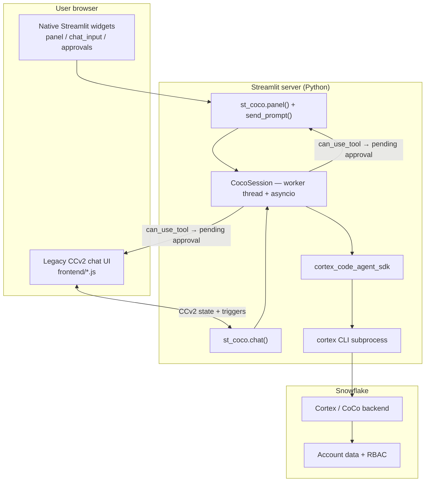
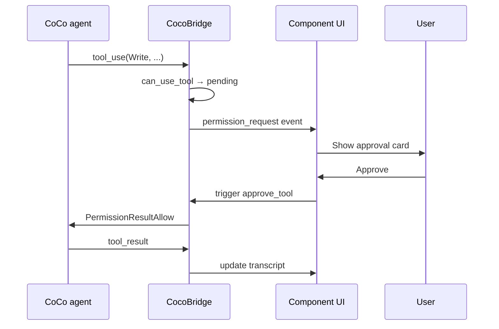

# PRD: streamlit-coco

**Product:** `streamlit-coco` — a Streamlit component and Python library for embedding [Snowflake CoCo](https://www.snowflake.com/en/product/snowflake-coco/) (formerly Cortex Code) in Streamlit applications.

**Author:** —  
**Status:** Alpha `0.1.0` (Phase 3 shipped; release gate = tag + PyPI)  
**Last updated:** 2026-07-28

---

## 1. Executive summary

Data teams increasingly build internal tools in Streamlit, but Snowflake CoCo today is primarily consumed through CLI, Snowsight, Desktop, and IDE extensions. **`streamlit-coco` bridges that gap**: it wraps the [Cortex Code Agent SDK](https://docs.snowflake.com/en/user-guide/cortex-code-agent-sdk/cortex-code-agent-sdk) (`cortex_code_agent_sdk`) and exposes:

1. **A Python API** for programmatic, headless agent orchestration (`query()`, `CocoSession`).
2. **A preferred native Streamlit UI** — `panel()` + app-owned `st.chat_input` / `send_prompt()`, with streaming transcript, tool cards, and approval gates.
3. **A legacy Custom Component (v2)** — `chat()` with built-in input — still supported for all-in-one embeds.

Designed for Snowflake-native workflows: SQL generation, semantic view design, dbt/Airflow scaffolding, data profiling, and governed tool execution against a live Snowflake account.

---

## 2. Problem statement

### 2.1 User pain

| Persona | Pain today |
| --- | --- |
| **Streamlit app developer** | Must hand-roll subprocess/NDJSON parsing, async streaming, and permission UX to embed CoCo. |
| **Analytics engineer / data analyst** | Wants CoCo inside operational dashboards, not only in a separate terminal or Snowsight tab. |
| **Platform / governance owner** | Needs visible approval gates before destructive tools (Write, Bash, SQL DDL) run from a web UI. |

### 2.2 Why Streamlit specifically

- Streamlit is the de facto framework for Snowflake-adjacent internal apps (Cortex Analyst demos, FinOps dashboards, semantic layer explorers).
- Streamlit’s rerun model conflicts with long-running agent loops and blocking permission prompts — a dedicated component must reconcile **async agent I/O** with **synchronous script reruns**.
- Custom Components v2 (`st.components.v2`) provides bidirectional state/trigger channels ideal for chat UX and one-shot user responses.

### 2.3 Constraints from CoCo

- The SDK spawns the `cortex` CLI as a subprocess and communicates over **NDJSON on stdout**.
- Tool permissions are enforced via `allowed_tools`, `permission_mode`, and the async **`can_use_tool`** callback — the natural hook for UI confirmations.
- Multi-turn context requires a persistent **`CortexCodeSDKClient`** session; single-turn tasks use **`query()`**.
- CoCo must be installed and authenticated on the **runtime host** (Streamlit server), not in the end-user’s browser.

---

## 3. Goals and non-goals

### 3.1 Goals (v1)

| ID | Goal |
| --- | --- |
| G1 | Ship a pip-installable package `streamlit-coco` with a declarative Python API and a mountable Streamlit component. |
| G2 | Stream CoCo NDJSON messages to the UI in near real time (assistant text, tool calls, tool results, thinking, completion). |
| G3 | Support **human-in-the-loop** interactions: approve/deny tool use, provide extra context, answer clarifying questions, cancel/stop the agent. |
| G4 | Preserve **multi-turn conversation context** within a Streamlit session via `CortexCodeSDKClient`. |
| G5 | Integrate cleanly with **`st.session_state`**, Snowflake connections, and Streamlit theming (`--st-*` CSS variables). |
| G6 | Document deployment requirements (CLI, credentials, SPCS vs local server). |
| G7 | Isolate agent UI reruns with **`@st.fragment`** so the rest of the app does not rerun on every stream tick or chat interaction (`panel()` and `chat()`). |

### 3.2 Non-goals (v1)

| ID | Non-goal | Rationale |
| --- | --- | --- |
| NG1 | Replace CoCo CLI / SDK or proxy LLM calls from the browser | Security and licensing; agent runs server-side only. |
| NG2 | Host CoCo as a managed SaaS | Out of scope; users bring their own Snowflake + CLI setup. |
| NG3 | Full IDE features (file tree, diff editor, multi-tab workspace) | CoCo Desktop / VS Code extension territory. |
| NG4 | TypeScript SDK parity | Python-first; TS consumers can use CoCo SDK directly. |
| NG5 | Slack / MCP server implementations | May come later; v1 focuses on Streamlit embedding. |
| NG6 | Remote agent proxy / sidecar HTTP service | Explicitly out of scope; CoCo CLI must run on the Streamlit server host. |
| NG7 | File upload into `cwd` from the browser | Deferred; users reference Snowflake objects or paths already on the server. |

---

## 4. Target users and use cases

### 4.1 Personas

1. **App builder** — integrates `st_coco.panel()` + `st.chat_input` (or legacy `st_coco.chat()`) into a Streamlit multipage app.
2. **Operator** — interacts with the agent UI to approve SQL or pipeline changes.
3. **Automation author** — uses headless `query()` / `CocoSession.send()` in jobs triggered from Streamlit.

### 4.2 Primary use cases

| UC | Description | API mode |
| --- | --- | --- |
| UC1 | **Embedded data copilot** — chat in a semantic view or dbt project explorer | `panel()` (+ optional legacy `chat()`) |
| UC2 | **Guided pipeline builder** — agent proposes DDL/dbt models; user confirms each Write/Edit | UI + `can_use_tool` / `require_approval_for` |
| UC3 | **One-shot task** — “Profile this table and return JSON” with structured output | `coco.query()` |
| UC4 | **Multi-step wizard** — app drives turns programmatically between Streamlit steps | `CocoSession.send()` / `run()` / `stream()` |
| UC5 | **Audit trail** — stream logged via `on_event` / `events_to_dataframe` | Python events (+ SDK hooks pass-through) |

---

## 5. Product architecture

### 5.1 High-level diagram



### 5.2 Package layout (as implemented)

```
streamlit-coco/
├── streamlit_coco/
│   ├── __init__.py              # public exports
│   ├── ui.py                    # panel(), send_prompt(), render_approvals()
│   ├── display.py               # native transcript / field rendering
│   ├── component.py             # chat() CCv2 registration + mount
│   ├── session.py               # CocoSession, CocoChatResult, CocoRunStatus
│   ├── bridge.py                # session → CCv2 component data
│   ├── permissions.py           # can_use_tool UI integration
│   ├── messages.py              # NDJSON / SDK messages → CocoEvent
│   ├── options.py               # CocoOptions → CortexCodeAgentOptions
│   ├── query.py                 # headless query() wrapper
│   └── frontend/                # static CCv2 assets (html/css/js; no Vite yet)
├── examples/
│   ├── chat_app.py              # preferred panel + st.chat_input
│   ├── approval_gate.py
│   ├── structured_output.py
│   └── headless_pipeline.py
├── tests/
├── doc/prd.md
├── Makefile
└── pyproject.toml
```

### 5.3 Runtime model

Streamlit reruns the script top-to-bottom on every interaction. The agent loop is **long-lived and async**, so the bridge uses:

1. **`st.session_state`** — app stores `CocoSession` (often under the session `key`); transcript, pending approvals, and status live on the session object.
2. **Background thread + asyncio loop** — `CocoSession` worker reads the SDK stream; updates transcript under a lock.
3. **Native UI path** — `panel()` polls via `@st.fragment(run_every=…)` while a turn is active; approvals use Streamlit buttons.
4. **Legacy CCv2 path** — component `data` serializes transcript + pending prompts; triggers (`submit_prompt`, `approve_tool`, `deny_tool`, `cancel_run`) drive Python callbacks. No `provide_input` trigger (dropped; clarification uses AskUserQuestion on the native path).
5. **`@st.fragment` isolation** — both `panel()` and `chat()` default to `use_fragment=True` so streaming updates rerun only the CoCo panel.

### 5.4 Fragment boundary (decision)

`panel()` and `chat()` wrap output + polling in `@st.fragment` unless `use_fragment=False`. Structured-output callbacks (`on_structured_output`) run inside the same fragment so delegated widgets stay co-located with the panel.

---

## 6. Functional requirements

### 6.1 Python public API

#### 6.1.1 Configuration — `CocoOptions`

Thin, documented wrapper over `CortexCodeAgentOptions`:

| Field | Type | Description |
| --- | --- | --- |
| `connection` | `str \| None` | Snowflake connection name (from `~/.snowflake/connections.toml`) |
| `cwd` | `str` | Working directory for file tools |
| `model` | `str \| None` | e.g. `claude-sonnet-4-6`, `claude-opus-4-6`, `auto` |
| `allowed_tools` | `list[str]` | Tools that may auto-run without a prompt (when approvals are configured, enforced in Python — not via CLI `--allowed-tools`) |
| `disallowed_tools` | `list[str]` | Tool blacklist |
| `permission_mode` | `str` | `default`, `acceptEdits`, `plan`, `bypassPermissions` |
| `profile` | `str \| None` | Named CoCo profile |
| `cli_path` | `str \| None` | Custom `cortex` binary path |
| `mcp_servers` | `dict` | MCP server map (passed through to SDK) |
| `hooks` | `dict` | SDK lifecycle hooks (pass-through) |
| `require_approval_for` | `list[str] \| Callable` | Tools that always pause for UI approval |
| `output_schema` | `dict \| None` | JSON Schema → SDK `output_format` structured output |
| `max_turns` | `int \| None` | Max agentic turns |
| `approval_timeout_seconds` | `float` | Pending approval wait (default 600) |
| `extra_sdk_options` | `dict` | Escape hatch for additional `CortexCodeAgentOptions` fields |

#### 6.1.2 Headless single-turn — `coco.query()`

```python
import streamlit_coco as coco

async for event in coco.query("Summarise ANALYTICS.CUSTOMERS", options=opts):
    if event.type == "assistant_text":
        ...
    elif event.type == "result":
        break
```

**Requirements:**

- Wraps SDK `query()`; yields normalized **`CocoEvent`** objects (see §6.2).
- Supports `output_schema: dict` for structured JSON results on `result.structured_output`.
- Typed exception hierarchy: `streamlit_coco.errors` (+ `require_environment()`).

#### 6.1.3 Multi-turn session — `CocoSession`

```python
session = coco.CocoSession(options=opts, key="coco_main")
session.send("Read the schema for ANALYTICS")  # queues on background worker
# UI polls via panel()/chat() fragments while session.needs_polling
# Headless: async for event in session.stream("…"): …  /  await session.run("…")
session.cancel()
session.reset()
session.close()
```

**Requirements / status:**

- Wraps `CortexCodeSDKClient` on a background thread + asyncio loop.
- **`key`** registers the session in an in-process registry (`get_session(key)` / `get_or_create_session`).
- Methods: `send(prompt)`, `run(prompt)`, `stream(prompt)`, `cancel()`, `close()`, `reset()`, `sync_options()`, `execute_plan()`, `set_permission_mode()`.
- Properties: `is_running`, `needs_polling`, `messages` / transcript, `last_result`, `status`.
- **UI path** still uses the worker + `panel()` / `chat()` polling; headless scripts use `stream()` / `run()` without loading Streamlit.

#### 6.1.4 Preferred Streamlit UI — `panel()` + `send_prompt()`

```python
import streamlit as st
import streamlit_coco as st_coco

session = st_coco.CocoSession(options=opts, key="copilot")
st_coco.panel(session=session, output_mode="transcript", run_every=0.25)

prompt = st.chat_input("Ask CoCo…")
if prompt:
    st_coco.send_prompt(session, prompt)
```

**Requirements:**

| ID | Requirement | Status |
| --- | --- | --- |
| FR-P1 | App owns input (`st.chat_input` or custom); library owns transcript / field output | ✅ |
| FR-P2 | `output_mode`: `transcript` or `field` | ✅ |
| FR-P3 | Native approval controls (Deny / Approve once / Always allow) via `render_approvals` | ✅ |
| FR-P4 | Stop button cancels the active turn | ✅ |
| FR-P5 | `use_fragment=True` + `run_every` polling while `needs_polling` | ✅ |
| FR-P6 | `on_structured_output` / `structured_output_container` (same rules as §6.6) | ✅ |
| FR-P7 | CoCo branding in labels / empty states | ✅ |

#### 6.1.5 Legacy Streamlit component — `st_coco.chat()`

```python
result = st_coco.chat(
    session=session,
    height=600,
    show_tool_details=True,
    show_thinking=False,
    placeholder="Ask CoCo about your data…",
    key="coco_chat",
    use_fragment=True,
    on_structured_output=None,
)
```

All-in-one CCv2 UI with built-in input. Still supported; prefer `panel()` for new apps.

| ID | Requirement | Status |
| --- | --- | --- |
| FR-C1 | Scrollable transcript with assistant text | ✅ (plain text; limited markdown) |
| FR-C2 | Streams partial assistant text | ✅ |
| FR-C3 | Tool call cards | ✅ |
| FR-C4 | Run lifecycle statuses | ✅ |
| FR-C5 | Input + Send + Stop; no file upload | ✅ |
| FR-C6 | Permission card: Approve / Deny / Always allow | ✅ (native path includes Edit/Write unified diff; CCv2 parity lighter) |
| FR-C7 | Generic user input request surface | ✅ AskUserQuestion + app-owned `request_input` (CCv2 `provide_input` dropped) |
| FR-C8 | Emits `CocoChatResult` | ✅ |
| FR-C9 | CCv2 change callbacks | ✅ |
| FR-C10 | Theme via `--st-*` CSS variables | ✅ basic |
| FR-C11 | “CoCo” branding | ✅ |
| FR-C12–C13 | Inline / delegated structured output | ✅ |
| FR-C14 | `@st.fragment` default | ✅ |

#### 6.1.6 Imperative helpers

| Function | Purpose | Status |
| --- | --- | --- |
| `coco.get_session(key)` | Retrieve session from registry | ✅ |
| `coco.approve_pending` / `deny_pending` | Resolve blocked `can_use_tool` | ✅ |
| `coco.send_prompt(session, prompt)` | Queue user prompt (native UI) | ✅ |
| `coco.render_approvals(session)` | Native approval buttons | ✅ |
| `coco.events_to_dataframe(events)` | Flatten events for audit views | ✅ |
| `coco.request_input(...)` | App-owned clarification form (+ optional `schema=`) | ✅ (AskUserQuestion remains the in-turn CoCo channel) |

---

### 6.2 Event model — `CocoEvent`

Normalized events abstract SDK / NDJSON message types:

| `event.type` | Source SDK type | Payload highlights |
| --- | --- | --- |
| `system` | `SystemMessage` | Init metadata |
| `assistant_text` | `AssistantMessage` → `TextBlock` | `text`, `delta` |
| `thinking` | `ThinkingBlock` | `text` (hidden by default in UI) |
| `tool_use` | `ToolUseBlock` | `name`, `input`, `id` |
| `tool_result` | `ToolResultBlock` | `tool_use_id`, `content`, `is_error` |
| `stream_event` | `StreamEvent` | Partial deltas |
| `permission_request` | `can_use_tool` / `PermissionRequest` hook | `request_id`, `tool_name`, `tool_input` |
| `result` | `ResultMessage` | `subtype`, `duration_ms`, `structured_output`, `cost_usd` |
| `error` | exceptions / `result.subtype` errors | `message`, `code` |

All events are JSON-serializable for component `data` and logging.

---

### 6.3 Human-in-the-loop flows

#### 6.3.1 Tool approval (primary)



**Requirements:**

- While pending, agent asyncio task awaits a `asyncio.Event` (max timeout configurable, default 10 min).
- Deny returns `PermissionResultDeny` with optional user reason fed back to agent.
- “Approve always for this tool” caches allow-list in session state (does not override `disallowed_tools`).

#### 6.3.2 Supplemental user input

When the agent needs clarification not tied to a tool (or app developer inserts a gate):

- **`AskUserQuestion`** — in-turn CoCo channel; rendered as native HITL (radio / multiselect; free-form last).
- **`st_coco.request_input(question, schema=None, key=...)`** — app-owned form for out-of-band clarification (optional multi-field `schema=`).
- CCv2 `provide_input` trigger was **dropped**; do not reintroduce.

#### 6.3.3 Plan mode

When `permission_mode="plan"`, native `panel()` shows `render_plan_banner()` with an **Execute plan** CTA; legacy CCv2 has a matching banner trigger. `CocoSession.execute_plan()` / `set_permission_mode()` support the headless path.

---

### 6.4 Streaming UX requirements

| ID | Requirement | Priority | Status |
| --- | --- | --- | --- |
| FR-S1 | Assistant text appends in place without flicker (stable keys / fragment polling) | P0 | ✅ |
| FR-S2 | Auto-scroll to bottom while running; pause auto-scroll if user scrolls up | P1 | ⏳ Later — [`roadmap`](roadmap.md) |
| FR-S3 | Tool activity visible without hunting; errors prominent | P1 | ✅ **Superseded** — compact meaningful expanders (label always visible; body collapsed); auto-open on error ([`tools-display/SPEC`](features/tools-display/SPEC.md)); debug **Raw tool payload** nested collapsed |
| FR-S4 | Stop button sends SDK cancel/interrupt; UI marks run as `cancelled` | P0 | ✅ |
| FR-S5 | Show spinner / pulsing indicator during tool execution | P1 | ✅ progress captions while `running`; cleared on complete/error |
| FR-S6 | Render code blocks and SQL with syntax highlighting | P1 | ⏳ Later |
| FR-S7 | Copy-to-clipboard on assistant messages and tool results | P2 | ⏳ Later (explicit non-goal in current tools-display revision) |

---

### 6.5 Session and state management

| ID | Requirement | Status |
| --- | --- | --- |
| FR-ST1 | Session keyed in registry / `st.session_state`; transcript, pending approval, status on `CocoSession` | ✅ |
| FR-ST2 | Changing `options` mid-session calls `session.reset()` or warns user (configurable) | ⚠️ partial (`sync_options` / reset available; no forced warn UX) |
| FR-ST3 | `reset()` clears transcript and closes SDK client | ✅ |
| FR-ST4 | Transcript persists across reruns; optional `max_messages` truncation with “load earlier” | ✅ persistence; ⏳ truncation — Later |
| FR-ST5 | Multiple independent sessions via distinct `key` values on same page | ✅ |

---

### 6.6 Structured output rendering (decision)

When a turn completes with `output_schema` / `structured_output` on the `result` event:

| Mode | Behavior | When to use |
| --- | --- | --- |
| **Inline (default)** | Component renders a collapsible JSON block in the chat transcript | Quick inspection, demos, no custom layout |
| **`on_structured_output` callback** | Python callable invoked with `(structured_output: dict, result: CocoChatResult)`; author renders via any `st.*` API | Custom tables, charts, forms, domain-specific layouts |
| **`structured_output_container`** | Same as callback, but rendering is scoped to a passed `st.container()` / column / `DeltaGenerator` | Split layout: chat left, structured output right |

**Rules:**

- Inline panel and external rendering are **mutually exclusive** per turn: if `on_structured_output` or `structured_output_container` is set, skip the default inline JSON panel (structured data still appears on `result.structured_output`).
- Callback/container rendering runs inside the CoCo **fragment** so it stays in sync with chat reruns.
- Headless `query()` / `CocoSession` always expose raw `structured_output` on the `result` event regardless of UI mode.

```python
import streamlit as st
import streamlit_coco as st_coco

output_col = st.container()

def render_features(data: dict, result: st_coco.CocoChatResult) -> None:
    with output_col:
        st.subheader("Selected features")
        st.dataframe(data["selected_features"])

st_coco.panel(
    session=session,
    on_structured_output=render_features,
)
# or: st_coco.chat(session=session, on_structured_output=render_features)
```

---

## 7. Non-functional requirements

| Category | Requirement |
| --- | --- |
| **Performance** | First token visible ≤ 2s after prompt submit on warm session (network-dependent). UI rerender ≤ 100ms for incremental deltas batched at 50–100ms. |
| **Compatibility** | Python 3.10+; Streamlit ≥ 1.53 (Custom Components v2 + `@st.fragment`); `cortex-code-agent-sdk` version pinned in extras. |
| **Rerun scope** | Chat interactions and stream polling must not trigger full-app reruns when `use_fragment=True` (default on `panel()` / `chat()`). |
| **Security** | No Snowflake credentials in frontend `data`; tool inputs sanitized in markdown; CSP-safe component (no inline eval). |
| **Accessibility** | Keyboard submit (⌘/Ctrl+Enter); focus trap in approval modal; ARIA labels on actions. |
| **Observability** | Optional `on_event` callback for structured logging; hooks forwarded to SDK. |
| **Packaging** | Wheel includes static frontend assets; `pip install streamlit-coco[sdk]`. Dual-repo publish ready; first PyPI tag pending ([`deployment/publish.md`](deployment/publish.md)). |

---

## 8. Deployment and prerequisites

### 8.1 Server-side requirements

Document prominently in README:

1. **CoCo CLI** installed and on `PATH` (`cortex --version`).
2. **Authenticated Snowflake connection** in connections.toml or env vars.
3. Streamlit app runs on a host **allowed to spawn subprocesses** (local, VM, SPCS container — not typical browser-only Streamlit Cloud unless CLI pre-installed).
4. **`cortex-code-agent-sdk`** Python package.

### 8.2 Deployment topologies

| Topology | Support | Notes |
| --- | --- | --- |
| Local dev (`streamlit run`) | ✅ Primary | CLI on same machine |
| Local dev (`streamlit run`) | ✅ 0.2.0 | Remote CoCo API - No CLI |
| Snowpark Container Services | ✅ v1.1 | Agent operates on staged files |
| Streamlit Community Cloud | ⚠️ Limited | Only if CLI + secrets available on the host; no remote-proxy workaround planned |

---

## 9. API sketch (v1 — as implemented)

```python
# streamlit_coco/__init__.py exports
from streamlit_coco.options import CocoOptions
from streamlit_coco.session import CocoSession, CocoChatResult, CocoRunStatus, get_session
from streamlit_coco.messages import CocoEvent, events_to_dataframe
from streamlit_coco.ui import panel, send_prompt, render_approvals
from streamlit_coco.component import chat, request_input
from streamlit_coco.query import query
from streamlit_coco.permissions import approve_pending, deny_pending
from streamlit_coco.display import get_latest_assistant_text, render_transcript, render_output_field
```

### Minimal example app (preferred)

```python
import streamlit as st
import streamlit_coco as st_coco

st.title("CoCo for Streamlit")

opts = st_coco.CocoOptions(
    connection="analytics",
    cwd="/path/to/dbt/project",
    allowed_tools=["Read", "Glob", "Grep"],
    require_approval_for=["Edit", "Write", "Bash"],
)

if "copilot" not in st.session_state:
    st.session_state.copilot = st_coco.CocoSession(options=opts, key="copilot")

session = st.session_state.copilot
st_coco.panel(session=session, output_mode="transcript", run_every=0.25)

prompt = st.chat_input("Ask CoCo about your data…")
if prompt:
    st_coco.send_prompt(session, prompt)
```

### Structured output with custom Streamlit renderer

```python
metrics = st.container()

def show_pipeline_result(data: dict, result: st_coco.CocoChatResult) -> None:
    with metrics:
        st.metric("Features selected", len(data["selected_features"]))
        st.json(data)

st_coco.panel(
    session=st.session_state.copilot,
    on_structured_output=show_pipeline_result,
)
```
---

## 10. UX wireframe (logical)

Preferred native layout (`panel` + `st.chat_input`):

```
┌─────────────────────────────────────────────────────────────┐
│  CoCo for Streamlit                                         │
├─────────────────────────────────────────────────────────────┤
│  ┌ CoCo transcript ───────────────────────────────────────┐ │
│  │ User / Assistant / Tool cards / Approvals…             │ │
│  │                                         [ Stop CoCo ]  │ │
│  └────────────────────────────────────────────────────────┘ │
│  ┌ Ask CoCo about your data… ──────────── st.chat_input ─┐ │
│  └────────────────────────────────────────────────────────┘ │
└─────────────────────────────────────────────────────────────┘
```

Legacy CCv2 `chat()` keeps an all-in-one panel (header, transcript, approval card, built-in Send/Stop) as sketched previously.
---

## 11. Milestones

### Phase 0 — Foundation

- [x] Repo scaffold, pyproject
- [x] `CocoEvent` parser from NDJSON / SDK messages
- [x] `CocoSession` wrapping `CortexCodeSDKClient`
- [x] Unit tests (inline fixtures)
- [x] CI workflow
- [x] Recorded NDJSON fixture corpus

### Phase 1 — Headless API

- [x] `query()` async generator
- [x] `CocoOptions` (+ `output_schema`, `extra_sdk_options`, …)
- [x] Example: headless pipeline script
- [x] Typed error hierarchy
- [x] `CocoSession.stream()` / `run()` async API

### Phase 2 — Component / UI MVP

- [x] CCv2 component registration + **static** frontend assets (Vite build deferred → Later)
- [x] Native `panel()` + `send_prompt()` (preferred path)
- [x] `@st.fragment` wrapper (`use_fragment=True` default)
- [x] Transcript rendering + prompt input + cancel
- [x] Streaming assistant text
- [x] Tool call cards (meaningful cards — see tools-display SPEC)
- [x] Inline structured output panel (default)

### Phase 3 — Human-in-the-loop

- [x] `can_use_tool` ↔ approval UI
- [x] `approve_pending` / `deny_pending`
- [x] `on_structured_output` + `structured_output_container`
- [x] Example: approval gate app
- [x] Plan mode **Execute** CTA
- [x] App-owned `request_input` (+ AskUserQuestion HITL)
- [x] Edit/Write unified diff preview on approvals (native path)
- [x] Pluggable text renderer (`text_renderer=`)

### Phase 4 — Polish & release

- [x] README + Makefile + GitHub repos (`streamlit-coco-dev` + public `streamlit-coco`)
- [ ] Theming / a11y pass (syntax highlight, copy, keyboard traps) — Later / FR-S6 / FR-S7
- [ ] PyPI publish `0.1.0`
- [ ] Deployment docs beyond local (Docker, SPCS)

**Current:** Alpha `0.1.0`; Phase 3 complete; Phase 4 release items remain. Living plan: [`roadmap.md`](roadmap.md).

---

## 12. Success metrics

| Metric | Target (90 days post-launch) |
| --- | --- |
| PyPI downloads | 500+ |
| GitHub stars | 50+ |
| Median time-to-first-working-app | < 30 min following quickstart |
| Issue: “streaming broken on rerun” | 0 open P0 past 30 days |
| Community examples | ≥ 3 contributed sample apps |

---

## 13. Risks and mitigations

| Risk | Impact | Mitigation |
| --- | --- | --- |
| Streamlit rerun races with async agent | Broken streams, duplicate clients | Single bridge per session; idempotent mount; mutex on client lifecycle |
| CoCo CLI not on Streamlit Cloud | Blocks hosted demos | Document SPCS/local deployment; no remote proxy planned |
| SDK / NDJSON schema changes | Parser breaks | Pin SDK version; fixture tests; tolerant parsing |
| Long approval waits block worker | Timeouts | Configurable timeout; deny with message; session cancel |
| Sensitive data in tool inputs shown in UI | Compliance | Redaction hooks; `show_tool_details=False`; audit mode |

---

## 14. Product decisions (resolved)

| # | Question | Decision |
| --- | --- | --- |
| 14.1 | Remote agent proxy (sidecar HTTP service for Streamlit Cloud)? | **No.** CoCo CLI runs on the Streamlit server host only; no proxy layer. |
| 14.2 | Structured output UX? | **Inline in the transcript by default** (collapsible JSON). App authors may delegate via **`on_structured_output`** and/or **`structured_output_container`** (see §6.6). |
| 14.3 | File upload into `cwd`? | **No** in v1. Users reference server-side paths or Snowflake objects. |
| 14.4 | Branding? | **“CoCo”** in all user-facing UI copy. |
| 14.5 | Async Streamlit / fragments? | **Yes.** `@st.fragment` is the default rerun boundary for `panel()` and `chat()`. |
| 14.6 | Primary Streamlit UX? | **`panel()` + app-owned `st.chat_input` / `send_prompt()`.** Legacy all-in-one **`chat()`** (CCv2) remains supported. |
| 14.7 | Frontend build? | **Static** html/css/js under `streamlit_coco/frontend/` for now; Vite/`asset_dir` packaging is **Later** on the roadmap (optional). |

---

## 15. References

- [Snowflake CoCo product page](https://www.snowflake.com/en/product/snowflake-coco/)
- [Cortex Code Agent SDK deep dive (Snowflake Builders Blog)](https://medium.com/snowflake/building-programmable-ai-agents-on-snowflake-a-deep-dive-into-the-cortex-code-agent-sdk-811be94b004e)
- [Streamlit Custom Components v2 — registration & bidirectional communication](https://docs.streamlit.io/develop/concepts/custom-components/components-v2/register)
- [Streamlit CCv2 state vs triggers](https://docs.streamlit.io/develop/concepts/custom-components/components-v2/state-and-triggers)
- Package: `cortex-code-agent-sdk` (`CortexCodeSDKClient`, `query`, `CortexCodeAgentOptions`, `can_use_tool`)
- [Cortex Code Agent SDK docs](https://docs.snowflake.com/en/user-guide/cortex-code-agent-sdk/cortex-code-agent-sdk)
- Repo (public): https://github.com/DevoteamSP/streamlit-coco
- Repo (dev): https://github.com/DevoteamSP/streamlit-coco-dev
- Publish: [`doc/deployment/publish.md`](deployment/publish.md)

---

## Appendix A — SDK message mapping

| Raw NDJSON `type` | Block `type` | `CocoEvent.type` |
| --- | --- | --- |
| `assistant` | `text` | `assistant_text` |
| `assistant` | `thinking` | `thinking` |
| `assistant` | `tool_use` | `tool_use` |
| `assistant` | `tool_result` | `tool_result` |
| `result` | — | `result` |
| `stream_event` | — | `stream_event` |
| (hook) | — | `permission_request` |

## Appendix B — CCv2 component state & trigger keys (`chat()` only)

| Key | Kind | Direction | Purpose |
| --- | --- | --- | --- |
| `transcript` | state | Py → JS | Serialized messages for render |
| `status` | state | Py → JS | `idle`, `running`, `awaiting_user`, `error` |
| `pending_approval` | state | Py → JS | Active permission request or null |
| `scroll_token` | state | Py → JS | Force scroll on new content |
| `submit_prompt` | trigger | JS → Py | User sent a new message |
| `approve_tool` | trigger | JS → Py | `{ request_id, always: bool }` |
| `deny_tool` | trigger | JS → Py | `{ request_id, reason?: str }` |
| `cancel_run` | trigger | JS → Py | Stop current agent turn |
| `cancel_run` | trigger | JS → Py | Stop / interrupt |
| ~~`provide_input`~~ | — | — | **Dropped** — use AskUserQuestion / native HITL |
